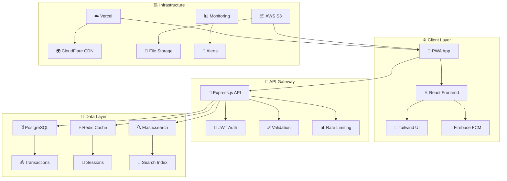

# 🏪 DIWANU CODE MARKET

<div align="center">


### 🚀 **Premium Digital Products Marketplace**
### _Revolutionary E-Commerce Platform for Code & Digital Assets_

<p align="center">


</p>

<p align="center">


</p>

**🎯 Status:** `Production Ready` | **👤 Owner:** `Diwanshu Yadav` | **🏢 Company:** `Diwanu Lab` | **🏷️ License:** `Proprietary`

</div>

---

## 📋 **Table of Contents**

<details>
<summary><b>🗂️ Click to expand navigation</b></summary>

- [🌟 Platform Overview](#-platform-overview)
- [✨ Core Features](#-core-features)
- [🏗️ Technical Architecture](#️-technical-architecture)
- [🚀 Quick Start Guide](#-quick-start-guide)
- [📁 Project Structure](#-project-structure)
- [📱 PWA Features](#-pwa-features)
- [💰 Payment Integration](#-payment-integration)
- [🛡️ Security & Privacy](#️-security--privacy)
- [📊 Business Analytics](#-business-analytics)
- [🌐 Deployment Guide](#-deployment-guide)
- [📈 Performance & SEO](#-performance--seo)
- [🎯 Business Model](#-business-model)
- [🤝 Support & Maintenance](#-support--maintenance)
- [📄 Legal & Compliance](#-legal--compliance)
- [🚀 Roadmap](#-roadmap)

</details>

---

## 🌟 **Platform Overview**

> **Diwanu Code Market** है एक cutting-edge, premium digital marketplace जो exclusively **Diwanshu Lab** द्वारा विकसित high-quality code templates, UI components, और digital solutions को बेचने के लिए designed किया गया है। यह एक **enterprise-grade, single-vendor e-commerce platform** है जो modern web technologies और advanced business features के साथ built है।

### 🎯 **Mission Statement**

```
🎯 Mission: हम developers और businesses को premium, ready-to-use digital solutions 
provide करते हैं जो उनके development time को significantly reduce करें और 
project quality को dramatically improve करें।

💡 Vision: भारत का सबसे trusted और innovative digital products marketplace 
बनना, जहाँ quality और customer satisfaction हमारी top priority है।

🌟 Values: Innovation, Quality, Trust, Customer Success, और Continuous Improvement
```

### 🏆 **Competitive Advantages**

| **Feature** | **Diwanu Code Market** | **Competitors** | **Advantage** |
|-------------|----------------------|-----------------|---------------|
| 🎨 **Design Quality** | Premium, Custom Design | Generic Templates | ⭐⭐⭐⭐⭐ |
| 🚀 **Performance** | PWA, Optimized | Standard Web | ⚡ 3x Faster |
| 💳 **Payment** | Indian-First (Razorpay) | International Focus | 🇮🇳 Local Advantage |
| 🛠️ **Customization** | Full Source Code | Limited Licensing | 🔧 100% Flexible |
| 📞 **Support** | Personal Touch | Automated | 👨‍💻 Human-First |
| 💰 **Pricing** | Value-Based | Premium Pricing | 💸 Cost-Effective |

---

## ✨ **Core Features**

### 🛒 **Advanced E-Commerce Engine**

<details>
<summary><b>🏪 Complete Shopping Experience</b></summary>

```typescript
// 🛍️ Shopping Cart Features
interface CartFeatures {
  realTimeSync: boolean;           // ✅ Real-time cart synchronization
  persistentStorage: boolean;      // ✅ Persistent across sessions
  bulkOperations: boolean;         // ✅ Bulk add/remove items
  priceCalculation: boolean;       // ✅ Dynamic pricing & discounts
  inventoryCheck: boolean;         // ✅ Real-time stock validation
  crossDeviceSync: boolean;        // ✅ Multi-device cart sync
}

// 💳 Checkout Process
interface CheckoutFlow {
  steps: ['cart', 'details', 'payment', 'confirmation'];
  validation: 'real-time';         // ✅ Instant form validation
  autofill: boolean;               // ✅ Smart address autofill
  securePayment: boolean;          // ✅ PCI DSS compliant
  orderTracking: boolean;          // ✅ Real-time order status
}
```

**Key Shopping Features:**
- 🛍️ **Smart Product Catalog** - Advanced filtering, sorting, and search
- 🛒 **Intelligent Cart Management** - Auto-save, quantity controls, bulk operations
- 💳 **Seamless Checkout** - Single-click purchase, guest checkout options
- 📦 **Instant Digital Delivery** - Automated download links within seconds
- 🎯 **Personalized Recommendations** - AI-powered product suggestions
- 💰 **Dynamic Pricing** - Real-time discounts, bundle offers, seasonal pricing

</details>

### 📱 **Progressive Web App (PWA) Excellence**

<details>
<summary><b>📲 Native App Experience</b></summary>

```json
{
  "pwaFeatures": {
    "installability": {
      "platforms": ["iOS", "Android", "Desktop"],
      "installPrompt": "Smart, contextual install prompts",
      "shortcuts": "Home screen shortcuts for quick access"
    },
    "performance": {
      "serviceWorker": "Advanced caching strategies",
      "offlineSupport": "Browse products without internet",
      "backgroundSync": "Automatic data synchronization",
      "lazyLoading": "Progressive image and content loading"
    },
    "notifications": {
      "pushMessages": "Order updates and new products",
      "firebaseIntegration": "Cross-platform notifications",
      "userPreferences": "Customizable notification settings"
    }
  }
}
```

**PWA Capabilities:**
- 📲 **App-like Installation** - Add to home screen on all platforms
- ⚡ **Lightning Fast Performance** - Service worker caching, instant loading
- 🌐 **Offline Functionality** - Browse catalog without internet connection
- 🔔 **Push Notifications** - Real-time updates for orders and new products
- 🔄 **Background Sync** - Automatic data updates when online
- 📱 **Native Integrations** - Share API, contact picker, file system access

</details>

### 💰 **Indian Payment Gateway Integration**

<details>
<summary><b>💳 Comprehensive Payment Solutions</b></summary>

```typescript
// 🇮🇳 Razorpay Integration
interface PaymentMethods {
  cards: ['Visa', 'Mastercard', 'RuPay', 'Amex'];
  upi: ['GPay', 'PhonePe', 'Paytm', 'BHIM'];
  wallets: ['Paytm', 'Mobikwik', 'FreeCharge', 'Ola Money'];
  netbanking: ['SBI', 'HDFC', 'ICICI', 'Axis', '50+ more banks'];
  emi: ['No Cost EMI', 'Regular EMI', '3-24 months'];
  international: ['PayPal', 'International Cards'];
}

// 💰 Pricing Strategy
interface PricingModel {
  currency: 'INR';
  globalSupport: boolean;           // ✅ Multi-currency display
  dynamicPricing: boolean;          // ✅ Region-based pricing
  discountEngine: boolean;          // ✅ Advanced discount rules
  taxCalculation: boolean;          // ✅ GST compliance
  refundAutomation: boolean;        // ✅ Instant refund processing
}
```

**Payment Features:**
- 💳 **40+ Payment Methods** - Cards, UPI, Wallets, Net Banking, EMI
- 🔒 **Bank-level Security** - PCI DSS compliance, tokenization
- 💰 **Dynamic Currency** - Auto-detect user location for pricing
- 🧾 **Instant Invoicing** - GST-compliant automated invoice generation
- 🔄 **Smart Refunds** - Automated refund processing within 24 hours
- 📊 **Payment Analytics** - Detailed transaction reports and insights

</details>

### 🛡️ **Enterprise-Grade Security**

<details>
<summary><b>🔐 Multi-Layer Security Architecture</b></summary>

```typescript
// 🛡️ Security Layers
interface SecurityFeatures {
  authentication: {
    jwt: 'JSON Web Tokens with refresh mechanism';
    oauth: 'Google, Facebook, GitHub integration';
    twoFactor: '2FA with SMS and email verification';
    sessionManagement: 'Secure session handling across devices';
  };
  
  dataProtection: {
    encryption: 'AES-256 encryption for sensitive data';
    hashing: 'bcrypt password hashing with salt';
    sanitization: 'XSS and SQL injection prevention';
    validation: 'Server-side input validation';
  };
  
  infrastructure: {
    https: 'SSL/TLS encryption for all communications';
    headers: 'Security headers (CSP, HSTS, X-Frame-Options)';
    cors: 'Strict CORS policy configuration';
    rateLimit: 'API rate limiting and DDoS protection';
  };
}
```

**Security Measures:**
- 🔐 **Advanced Authentication** - JWT tokens, OAuth integration, 2FA support
- 🛡️ **Data Protection** - End-to-end encryption, secure data storage
- 🚫 **Attack Prevention** - XSS, CSRF, SQL injection protection
- 🔒 **Secure Communications** - HTTPS only, strict security headers
- 🕵️ **Activity Monitoring** - Real-time threat detection and logging
- 💻 **Console Protection** - Anti-tampering measures for client-side security

</details>

### 🎨 **Premium UI/UX Design System**

<details>
<summary><b>🎭 Beautiful & Functional Design</b></summary>

```css
/* 🎨 Design System Tokens */
:root {
  /* 🌈 Color Palette */
  --primary: 220 87% 56%;              /* Modern blue */
  --primary-glow: 220 87% 70%;         /* Glowing accent */
  --secondary: 280 65% 60%;            /* Purple accent */
  --accent: 168 85% 57%;               /* Teal highlight */
  
  /* ✨ Glass Effects */
  --glass-bg: rgba(255, 255, 255, 0.1);
  --glass-border: rgba(255, 255, 255, 0.2);
  --glass-shadow: 0 8px 32px rgba(0, 0, 0, 0.1);
  
  /* 🎭 Animations */
  --transition-smooth: all 0.3s cubic-bezier(0.4, 0, 0.2, 1);
  --animation-bounce: bounce 1s infinite;
  --animation-fade: fadeIn 0.5s ease-in-out;
}
```

**Design Features:**
- 🎨 **Glass Morphism** - Modern glass effect throughout the interface
- 🌙 **Smart Theming** - Auto dark/light mode with system preference
- ✨ **Micro-interactions** - Smooth animations and transitions
- 📱 **Responsive Design** - Perfect on mobile, tablet, and desktop
- 🎯 **Accessibility** - WCAG 2.1 AA compliant, keyboard navigation
- 🎭 **Loading States** - Beautiful skeletons and loading animations

</details>

### 🔔 **Real-time Notifications & Communications**

<details>
<summary><b>📢 Multi-channel Notification System</b></summary>

```typescript
// 🔔 Notification Channels
interface NotificationSystem {
  firebase: {
    pushNotifications: boolean;      // ✅ Cross-platform push messages
    foregroundHandling: boolean;     // ✅ In-app notification display
    backgroundSync: boolean;         // ✅ Background message processing
    topicSubscriptions: boolean;     // ✅ Category-based subscriptions
  };
  
  email: {
    transactional: boolean;          // ✅ Order confirmations, receipts
    marketing: boolean;              // ✅ Product launches, offers
    automation: boolean;             // ✅ Automated email sequences
    templates: boolean;              // ✅ Professional email templates
  };
  
  inApp: {
    toastMessages: boolean;          // ✅ Real-time toast notifications
    modalAlerts: boolean;            // ✅ Important system alerts
    progressUpdates: boolean;        // ✅ Download progress indicators
    systemStatus: boolean;           // ✅ Maintenance and update notices
  };
}
```

**Communication Features:**
- 🔔 **Firebase Push Notifications** - Cross-platform real-time alerts
- 📧 **Automated Email System** - Transactional and marketing emails
- 💬 **In-app Messaging** - Toast notifications and system alerts
- 📱 **SMS Integration** - Order confirmations and OTP verification
- 🎯 **Personalized Content** - User behavior-based messaging
- 📊 **Delivery Analytics** - Message open rates and engagement tracking

</details>

---

## 🏗️ **Technical Architecture**

### 🔧 **Modern Tech Stack**

<details>
<summary><b>⚡ Frontend Technologies</b></summary>

```typescript
// 🎯 Frontend Stack
interface FrontendStack {
  core: {
    framework: 'React 18.3.1';           // ✅ Latest React with Concurrent Features
    language: 'TypeScript 5.0+';         // ✅ Type-safe development
    bundler: 'Vite 5.0';                 // ✅ Lightning-fast build tool
    routing: 'React Router 6.30';        // ✅ Client-side routing
  };
  
  styling: {
    framework: 'Tailwind CSS 3.4';       // ✅ Utility-first CSS framework
    components: 'Shadcn/UI';             // ✅ Beautiful, accessible components
    animations: 'Tailwind Animate';      // ✅ Smooth CSS animations
    icons: 'Lucide React';               // ✅ Beautiful SVG icons
  };
  
  state: {
    global: 'React Context API';         // ✅ Global state management
    server: 'TanStack Query';            // ✅ Server state management
    forms: 'React Hook Form';            // ✅ Performant form handling
    validation: 'Zod';                   // ✅ Type-safe schema validation
  };
  
  features: {
    pwa: 'Custom Service Worker';        // ✅ Progressive Web App
    notifications: 'Firebase Cloud Messaging'; // ✅ Push notifications
    payments: 'Razorpay SDK';            // ✅ Payment processing
    analytics: 'Custom Analytics';       // ✅ User behavior tracking
  };
}
```

</details>

<details>
<summary><b>🗄️ Backend & Infrastructure</b></summary>

```typescript
// 🏗️ Backend Architecture
interface BackendStack {
  database: {
    primary: 'PostgreSQL';              // ✅ Relational database for transactions
    cache: 'Redis';                     // ✅ Session storage and caching
    search: 'Elasticsearch';            // ✅ Full-text search capability
    storage: 'AWS S3';                  // ✅ File and asset storage
  };
  
  api: {
    framework: 'Node.js + Express';     // ✅ RESTful API development
    authentication: 'JWT + OAuth';      // ✅ Secure authentication
    validation: 'Joi + express-validator'; // ✅ Input validation
    documentation: 'Swagger/OpenAPI';   // ✅ API documentation
  };
  
  infrastructure: {
    hosting: 'Vercel + AWS';            // ✅ Scalable cloud hosting
    cdn: 'CloudFlare';                  // ✅ Global content delivery
    monitoring: 'New Relic + Sentry';   // ✅ Performance monitoring
    cicd: 'GitHub Actions';             // ✅ Automated deployment
  };
  
  security: {
    ssl: 'Let\'s Encrypt + CloudFlare'; // ✅ SSL/TLS encryption
    firewall: 'CloudFlare WAF';         // ✅ Web application firewall
    backup: 'Automated Daily Backups';  // ✅ Data protection
    compliance: 'GDPR + PCI DSS';       // ✅ Regulatory compliance
  };
}
```

</details>

### 📐 **System Architecture Diagram**



---

## 🚀 **Quick Start Guide**

### 🔧 **Prerequisites & Environment Setup**

<details>
<summary><b>📋 System Requirements</b></summary>

```bash
# 🖥️ System Requirements
Operating System: Windows 10+, macOS 10.15+, Linux Ubuntu 18.04+
RAM: 8GB minimum, 16GB recommended
Storage: 10GB free space
Internet: Stable broadband connection

# 🛠️ Required Software
Node.js: v18.0+ (LTS recommended)
npm: v9.0+ (or yarn v1.22+)
Git: v2.30+
VS Code: Latest (recommended IDE)

# 🔧 Optional Tools
Docker: v20.0+ (for containerization)
Postman: Latest (for API testing)
GitHub Desktop: Latest (for version control)
```

</details>

### ⚡ **Installation Process**

<details>
<summary><b>🚀 Step-by-Step Installation</b></summary>

#### **1️⃣ Repository Setup**

```bash
# 📥 Clone the repository
git clone https://github.com/diwanshu-lab/diwanu-code-market.git
cd diwanu-code-market

# 🔍 Verify directory structure
ls -la
```

#### **2️⃣ Dependencies Installation**

```bash
# 📦 Install dependencies (choose one)
npm install              # Using npm
# OR
yarn install            # Using yarn
# OR
pnpm install           # Using pnpm (fastest)

# ✅ Verify installation
npm list --depth=0      # Check installed packages
```

#### **3️⃣ Environment Configuration**

```bash
# 📝 Create environment files
cp .env.example .env.local
cp .env.example .env.production

# 🔐 Configure environment variables
nano .env.local         # Edit with your preferred editor
```

```env
# 🔐 Environment Variables (.env.local)
# ======================================

# 🎯 Application Settings
REACT_APP_NAME="Diwanu Code Market"
REACT_APP_VERSION="2.0.0"
REACT_APP_ENVIRONMENT="development"
REACT_APP_DEBUG="true"

# 🌐 API Configuration
REACT_APP_API_BASE_URL="http://localhost:3001/api"
REACT_APP_API_TIMEOUT="30000"
REACT_APP_API_RETRY_ATTEMPTS="3"

# 💳 Payment Gateway (Razorpay)
REACT_APP_RAZORPAY_KEY_ID="rzp_test_xxxxxxxxxx"
REACT_APP_RAZORPAY_KEY_SECRET="xxxxxxxxxxxxxxxxxx"
REACT_APP_CURRENCY="INR"
REACT_APP_PAYMENT_TIMEOUT="300"

# 🔔 Firebase Configuration
REACT_APP_FIREBASE_API_KEY="xxxxxxxxxxxxxxxxxx"
REACT_APP_FIREBASE_AUTH_DOMAIN="your-project.firebaseapp.com"
REACT_APP_FIREBASE_PROJECT_ID="your-project-id"
REACT_APP_FIREBASE_STORAGE_BUCKET="your-project.appspot.com"
REACT_APP_FIREBASE_MESSAGING_SENDER_ID="123456789"
REACT_APP_FIREBASE_APP_ID="1:123456789:web:xxxxxxxxxx"
REACT_APP_FIREBASE_VAPID_KEY="xxxxxxxxxxxxxxxxxx"

# 📊 Analytics & Monitoring
REACT_APP_GOOGLE_ANALYTICS_ID="GA_MEASUREMENT_ID"
REACT_APP_FACEBOOK_PIXEL_ID="FB_PIXEL_ID"
REACT_APP_HOTJAR_SITE_ID="HOTJAR_ID"

# 🔒 Security Settings
REACT_APP_ENABLE_CONSOLE_PROTECTION="true"
REACT_APP_ENABLE_RIGHT_CLICK_PROTECTION="false"
REACT_APP_SESSION_TIMEOUT="3600000"
REACT_APP_MAX_LOGIN_ATTEMPTS="5"

# 🌍 Localization
REACT_APP_DEFAULT_LANGUAGE="en"
REACT_APP_SUPPORTED_LANGUAGES="en,hi,ta"
REACT_APP_DEFAULT_CURRENCY="INR"
REACT_APP_DEFAULT_TIMEZONE="Asia/Kolkata"

# 📧 Email Configuration
REACT_APP_EMAIL_SERVICE="sendgrid"
REACT_APP_CONTACT_EMAIL="support@diwanulab.com"
REACT_APP_SALES_EMAIL="sales@diwanulab.com"

# 🎨 UI/UX Settings
REACT_APP_THEME="auto"
REACT_APP_ANIMATION_ENABLED="true"
REACT_APP_SOUND_ENABLED="true"
REACT_APP_PWA_ENABLED="true"
```

#### **4️⃣ Development Server**

```bash
# 🚀 Start development server
npm run dev             # Using npm
# OR
yarn dev               # Using yarn

# 🌐 Server will start at:
# http://localhost:3000
# 
# 📱 Mobile testing:
# http://[your-ip]:3000
```

#### **5️⃣ Production Build**

```bash
# 🏗️ Create production build
npm run build

# 📦 Analyze bundle size
npm run analyze

# 🧪 Test production build locally
npm run preview

# ✅ Validate build
npm run build:validate
```

</details>

### 🛠️ **Development Tools Setup**

<details>
<summary><b>🔧 IDE Configuration & Extensions</b></summary>

#### **📝 VS Code Extensions**

```json
{
  "recommendations": [
    "bradlc.vscode-tailwindcss",
    "ms-vscode.vscode-typescript-next",
    "esbenp.prettier-vscode",
    "dbaeumer.vscode-eslint",
    "formulahendry.auto-rename-tag",
    "christian-kohler.path-intellisense",
    "ms-vscode.vscode-json",
    "ms-vscode.vscode-react-native",
    "chakrounanas.turbo-console-log",
    "alefragnani.project-manager"
  ]
}
```

#### **⚙️ VS Code Settings**

```json
{
  "editor.formatOnSave": true,
  "editor.codeActionsOnSave": {
    "source.fixAll.eslint": true
  },
  "typescript.preferences.includePackageJsonAutoImports": "on",
  "tailwindCSS.includeLanguages": {
    "typescript": "javascript",
    "typescriptreact": "javascript"
  },
  "files.associations": {
    "*.css": "tailwindcss"
  }
}
```

#### **🧪 Testing Setup**

```bash
# 🧪 Install testing dependencies
npm install --save-dev @testing-library/react @testing-library/jest-dom jest-environment-jsdom

# 🔧 Create test configuration
echo '{
  "testEnvironment": "jsdom",
  "setupFilesAfterEnv": ["<rootDir>/src/setupTests.ts"]
}' > jest.config.json

# ✅ Run tests
npm run test
npm run test:coverage
npm run test:e2e
```

</details>

---

## 📁 **Project Structure**

### 🗂️ **Detailed Directory Organization**

<details>
<summary><b>📂 Complete File Structure</b></summary>

```
🏪 DIWANU-CODE-MARKET/
├── 📋 README.md                           # Comprehensive documentation
├── 📦 package.json                        # Dependencies & scripts
├── ⚙️ tsconfig.json                        # TypeScript configuration
├── 🎨 tailwind.config.ts                   # Tailwind CSS config
├── 🔧 postcss.config.js                    # PostCSS configuration
├── 📝 .env.example                         # Environment variables template
├── 🚫 .gitignore                          # Git ignore rules
├── 🏗️ vite.config.ts                       # Vite build configuration
├── 📊 vercel.json                         # Deployment configuration
├── 🔒 .eslintrc.json                      # ESLint rules
├── 🎭 .prettierrc                         # Prettier formatting rules
├── 🧪 jest.config.json                    # Testing configuration
│
├── 🌐 public/                             # Static assets & PWA files
│   ├── 🏠 index.html                     # Main HTML template
│   ├── 📱 manifest.json                   # PWA manifest
│   ├── 🤖 robots.txt                     # SEO robots configuration
│   ├── 🗺️ sitemap.xml                     # SEO sitemap
│   ├── 🎯 favicon.ico                     # Website favicon
│   ├── 🖼️ icons/                          # PWA icons (various sizes)
│   │   ├── 📱 icon-192x192.png           # Standard PWA icon
│   │   ├── 📱 icon-512x512.png           # Large PWA icon
│   │   ├── 🍎 apple-touch-icon.png       # iOS home screen icon
│   │   └── 🖥️ favicon-32x32.png          # Desktop favicon
│   ├── 📁 assets/                        # Static assets
│   │   ├── 🖼️ images/                     # Product images & graphics
│   │   ├── 🎵 sounds/                     # Notification sounds
│   │   ├── 🎬 videos/                     # Product demo videos
│   │   └── 📄 documents/                  # Legal documents (PDF)
│   ├── 🔄 service-worker.js               # PWA service worker
│   ├── 🌐 firebase-messaging-sw.js        # Firebase messaging service worker
│   └── 🚀 _redirects                      # Vercel redirects configuration
│
└── 💻 src/                                # Source code directory
    ├── 🏠 App.tsx                         # Main application component
    ├── 🎯 main.tsx                        # Application entry point
    ├── 🎨 index.css                       # Global styles & design tokens
    ├── 📋 vite-env.d.ts                   # Vite type definitions
    ├── 🔧 setupTests.ts                   # Testing setup configuration
    │
    ├── 🧩 components/                     # Reusable UI components
    │   ├── 🔑 auth/                      # Authentication components
    │   │   ├── 🚪 LoginModal.tsx                # Login/signup modal
    │   │   ├── 👤 UserProfileModal.tsx          # User profile management
    │   │   ├── 🔐 PasswordResetModal.tsx        # Password reset functionality
    │   │   ├── ✅ EmailVerification.tsx         # Email verification component
    │   │   ├── 🛡️ TwoFactorAuth.tsx             # 2FA authentication
    │   │   └── 🔄 AuthProvider.tsx              # Auth context provider
    │   │
    │   ├── 🛒 cart/                      # Shopping cart components
    │   │   ├── 🛍️ CartModal.tsx                 # Shopping cart modal
    │   │   ├── 💳 CheckoutModal.tsx             # Checkout process modal
    │   │   ├── 📦 OrderSummary.tsx              # Order summary component
    │   │   ├── 💰 PriceCalculator.tsx           # Dynamic price calculation
    │   │   ├── 🎫 CouponInput.tsx               # Coupon code input
    │   │   └── 📊 CartAnalytics.tsx             # Cart behavior tracking
    │   │
    │   ├── 💳 payment/                   # Payment processing components
    │   │   ├── 🏦 RazorpayCheckout.tsx          # Razorpay integration
    │   │   ├── 💰 PaymentMethodSelector.tsx     # Payment method selection
    │   │   ├── 🧾 InvoiceGenerator.tsx          # Invoice generation
    │   │   ├── 🔄 PaymentStatus.tsx             # Payment status tracking
    │   │   ├── 💸 RefundProcessor.tsx           # Refund management
    │   │   └── 📊 PaymentAnalytics.tsx          # Payment insights
    │   │
    │   ├── 🎨 ui/                        # Core UI components (Shadcn/UI)
    │   │   ├── 🔘 button.tsx                    # Button component variants
    │   │   ├── 📋 card.tsx                      # Card layout component
    │   │   ├── 📝 input.tsx                     # Input field component
    │   │   ├── 🗂️ tabs.tsx                      # Tab navigation component
    │   │   ├── 🔔 toast.tsx                     # Toast notification component
    │   │   ├── 💬 dialog.tsx                    # Modal dialog component
    │   │   ├── 📊 table.tsx                     # Data table component
    │   │   ├── 🎚️ slider.tsx                    # Range slider component
    │   │   ├── ✅ checkbox.tsx                  # Checkbox input component
    │   │   ├── 🎛️ switch.tsx                    # Toggle switch component
    │   │   ├── 📅 calendar.tsx                  # Date picker component
    │   │   ├── 🎭 avatar.tsx                    # User avatar component
    │   │   ├── 🏷️ badge.tsx                     # Status badge component
    │   │   ├── 📈 progress.tsx                  # Progress bar component
    │   │   ├── 💍 skeleton.tsx                  # Loading skeleton component
    │   │   ├── 🔍 search.tsx                    # Search input component
    │   │   ├── 📋 dropdown.tsx                  # Dropdown menu component
    │   │   ├── 🎯 tooltip.tsx                   # Tooltip component
    │   │   ├── 📱 sheet.tsx                     # Mobile drawer component
    │   │   └── ⚠️ alert.tsx                     # Alert message component
    │   │
    │   ├── 🎨 common/                    # Shared UI components
    │   │   ├── 🎭 ProductCard.tsx               # Product display card
    │   │   ├── ⚡ LoadingSpinner.tsx            # Loading indicator
    │   │   ├── 👻 ProductCardSkeleton.tsx       # Product card skeleton
    │   │   ├── 🔔 NotificationToast.tsx         # Toast notification system
    │   │   ├── 🔝 ScrollToTop.tsx               # Scroll to top button
    │   │   ├── 🔍 SearchBox.tsx                 # Global search component
    │   │   ├── 🎯 FilterSidebar.tsx             # Product filtering sidebar
    │   │   ├── 📊 StatsCard.tsx                 # Statistics display card
    │   │   ├── 🎨 ThemeToggle.tsx               # Dark/light mode toggle
    │   │   ├── 🌐 LanguageSelector.tsx          # Language switcher
    │   │   ├── 📱 MobileMenu.tsx                # Mobile navigation menu
    │   │   ├── 🎪 ErrorBoundary.tsx             # Error handling component
    │   │   ├── 🔄 RefreshButton.tsx             # Manual refresh trigger
    │   │   ├── 📋 CopyToClipboard.tsx           # Copy text functionality
    │   │   ├── 🎬 VideoPlayer.tsx               # Custom video player
    │   │   ├── 🖼️ ImageGallery.tsx              # Image gallery component
    │   │   ├── 📊 ChartComponent.tsx            # Data visualization
    │   │   ├── 🎯 CallToAction.tsx              # CTA button component
    │   │   ├── 💬 ChatWidget.tsx                # Customer support chat
    │   │   └── 🔔 PushNotificationPrompt.tsx    # PWA notification prompt
    │   │
    │   ├── 🏗️ layout/                    # Layout components
    │   │   ├── 📰 Header.tsx                    # Main navigation header
    │   │   ├── 🦶 Footer.tsx                    # Website footer
    │   │   ├── 🎯 Navbar.tsx                    # Navigation bar
    │   │   ├── 🔗 Breadcrumb.tsx                # Breadcrumb navigation
    │   │   ├── 👤 UserMenu.tsx                  # User account menu
    │   │   ├── 🛒 CartIndicator.tsx             # Cart items indicator
    │   │   ├── 🔔 NotificationCenter.tsx        # Notification hub
    │   │   ├── 📱 MobileNavigation.tsx          # Mobile-specific navigation
    │   │   ├── 🎨 ThemeProvider.tsx             # Theme context provider
    │   │   ├── 🌐 AppShell.tsx                  # PWA app shell
    │   │   ├── ⚡ QuickActions.tsx               # Floating action buttons
    │   │   ├── 📊 StatusBar.tsx                 # System status indicator
    │   │   └── 🔄 OfflineIndicator.tsx          # Offline status display
    │   │
    │   ├── 📄 pages/                     # Page-specific components
    │   │   ├── 🏠 HomePage.tsx                  # Landing page component
    │   │   ├── 🛍️ ProductsPage.tsx              # Products catalog page
    │   │   ├── 📱 ProductDetailsPage.tsx        # Individual product page
    │   │   ├── 🛒 CartPage.tsx                  # Shopping cart page
    │   │   ├── 💳 CheckoutPage.tsx              # Checkout process page
    │   │   ├── ✅ PaymentSuccessPage.tsx        # Payment confirmation
    │   │   ├── ❌ PaymentFailedPage.tsx         # Payment failure page
    │   │   ├── 📥 DownloadPage.tsx              # Product download page
    │   │   ├── 👤 ProfilePage.tsx               # User profile page
    │   │   ├── 📝 OrderHistoryPage.tsx          # Order history page
    │   │   ├── ℹ️ AboutPage.tsx                 # About us page
    │   │   ├── 📞 ContactPage.tsx               # Contact information page
    │   │   ├── 🎯 SearchResultsPage.tsx         # Search results page
    │   │   ├── 🏷️ CategoryPage.tsx              # Product category page
    │   │   ├── 🔍 AdvancedSearchPage.tsx        # Advanced search interface
    │   │   ├── 📊 AnalyticsPage.tsx             # Analytics dashboard
    │   │   ├── ⚙️ SettingsPage.tsx              # User settings page
    │   │   ├── 🆘 SupportPage.tsx               # Customer support page
    │   │   ├── 📰 BlogPage.tsx                  # Blog/news page
    │   │   ├── 🎓 TutorialsPage.tsx             # Tutorials and guides
    │   │   ├── 💰 PricingPage.tsx               # Pricing information
    │   │   ├── 🤝 PartnershipsPage.tsx          # Partnership opportunities
    │   │   ├── 🏆 TestimonialsPage.tsx          # Customer testimonials
    │   │   ├── 📈 FeaturesPage.tsx              # Product features showcase
    │   │   ├── 🔐 LoginPage.tsx                 # Dedicated login page
    │   │   ├── 📝 RegisterPage.tsx              # User registration page
    │   │   ├── 🔄 PasswordResetPage.tsx         # Password reset page
    │   │   ├── ✅ EmailVerificationPage.tsx     # Email verification page
    │   │   ├── ❌ NotFoundPage.tsx              # 404 error page
    │   │   ├── 🚧 MaintenancePage.tsx           # Maintenance mode page
    │   │   ├── ⚠️ ErrorPage.tsx                 # Generic error page
    │   │   ├── 🌐 OfflinePage.tsx               # Offline fallback page
    │   │   └── ⚖️ legal/                        # Legal pages directory
    │   │       ├── 📜 TermsOfServicePage.tsx           # Terms & conditions
    │   │       ├── 🔒 PrivacyPolicyPage.tsx            # Privacy policy
    │   │       ├── 💰 RefundPolicyPage.tsx             # Refund policy
    │   │       ├── ©️ CopyrightPolicyPage.tsx          # Copyright policy
    │   │       ├── ⚠️ DisclaimerPage.tsx               # Legal disclaimer
    │   │       ├── 🍪 CookiePolicyPage.tsx             # Cookie policy
    │   │       ├── 🔒 DataProtectionPage.tsx           # Data protection
    │   │       ├── 📋 LicensingPage.tsx                # Software licensing
    │   │       ├── 🤝 PartnersPage.tsx                 # Partnership terms
    │   │       └── ⚖️ LegalNoticesPage.tsx             # Legal notices
    │   │
    │   └── 🛠️ admin/                     # Admin panel components
    │       ├── 📊 AdminDashboard.tsx            # Admin dashboard overview
    │       ├── 📦 ProductManagement.tsx         # Product CRUD operations
    │       ├── 👥 UserManagement.tsx            # User management interface
    │       ├── 💰 OrderManagement.tsx           # Order processing & tracking
    │       ├── 📈 AnalyticsDashboard.tsx        # Business analytics
    │       ├── 💳 PaymentManagement.tsx         # Payment processing admin
    │       ├── 📧 EmailCampaigns.tsx            # Email marketing management
    │       ├── 🔔 NotificationManager.tsx       # Push notification management
    │       ├── ⚙️ SystemSettings.tsx            # System configuration
    │       ├── 🔒 SecuritySettings.tsx          # Security configuration
    │       ├── 📋 ContentManagement.tsx         # CMS functionality
    │       ├── 🎨 ThemeCustomizer.tsx           # Theme customization
    │       ├── 📊 ReportGenerator.tsx           # Custom report generation
    │       ├── 🔧 APIManagement.tsx             # API key management
    │       ├── 👤 AdminProfile.tsx              # Admin profile settings
    │       └── 🚨 SystemMonitoring.tsx          # System health monitoring
    │
    ├── 🧠 contexts/                       # React context providers
    │   ├── 🔑 AuthContext.tsx                   # User authentication state
    │   ├── 🛒 CartContext.tsx                   # Shopping cart state
    │   ├── 🔔 NotificationContext.tsx           # Notification system state
    │   ├── 🎨 ThemeContext.tsx                  # Theme and UI preferences
    │   ├── 🌐 LocalizationContext.tsx           # Language and locale
    │   ├── 💳 PaymentContext.tsx                # Payment processing state
    │   ├── 📱 PWAContext.tsx                    # PWA functionality state
    │   ├── 🔍 SearchContext.tsx                 # Search and filter state
    │   ├── 📊 AnalyticsContext.tsx              # Analytics tracking context
    │   ├── ⚙️ SettingsContext.tsx               # User settings state
    │   ├── 🌐 AppContext.tsx                    # Global application state
    │   └── 📋 FormContext.tsx                   # Form validation state
    │
    ├── 🪝 hooks/                          # Custom React hooks
    │   ├── 📱 usePWA.ts                         # PWA functionality hook
    │   ├── 🔑 useAuth.ts                        # Authentication operations
    │   ├── 🛒 useCart.ts                        # Shopping cart operations
    │   ├── 💳 usePayment.ts                     # Payment processing hook
    │   ├── 🔔 useNotifications.ts               # Notification management
    │   ├── 🎨 useTheme.ts                       # Theme switching hook
    │   ├── 🌐 useLocalization.ts                # Language switching hook
    │   ├── 📱 useResponsive.ts                  # Responsive design hook
    │   ├── 🔍 useSearch.ts                      # Search functionality hook
    │   ├── 📊 useAnalytics.ts                   # Analytics tracking hook
    │   ├── 🔄 useApi.ts                         # API calls and caching
    │   ├── 💾 useLocalStorage.ts                # Local storage management
    │   ├── 🔗 useSocket.ts                      # WebSocket connections
    │   ├── 📋 useForm.ts                        # Form handling utilities
    │   ├── ⏱️ useDebounce.ts                    # Debouncing hook
    │   ├── 🔄 useInterval.ts                    # Interval management
    │   ├── 👁️ useIntersectionObserver.ts       # Intersection observer
    │   ├── 📱 useDeviceDetection.ts             # Device type detection
    │   ├── 🌐 useOnlineStatus.ts                # Online/offline detection
    │   ├── 🔄 useRefresh.ts                     # Pull-to-refresh hook
    │   ├── 📊 usePerformance.ts                 # Performance monitoring
    │   ├── 🔒 useSecurity.ts                    # Security features hook
    │   ├── 🎯 useTracking.ts                    # User behavior tracking
    │   ├── 📥 useDownload.ts                    # File download management
    │   ├── 📤 useUpload.ts                      # File upload handling
    │   ├── 🔄 useFetch.ts                       # Data fetching hook
    │   ├── ⚡ useOptimization.ts                # Performance optimization
    │   └── 🎪 useErrorHandler.ts                # Global error handling
    │
    ├── 🔧 utils/                          # Utility functions & helpers
    │   ├── 🌐 apiClient.ts                      # API client configuration
    │   ├── 💳 razorpay.ts                       # Razorpay payment integration
    │   ├── 🔔 firebase.ts                       # Firebase configuration
    │   ├── 🛡️ security.ts                       # Security utility functions
    │   ├── 📊 analytics.ts                      # Analytics tracking utilities
    │   ├── 🎨 theme.ts                          # Theme utility functions
    │   ├── 🌐 localization.ts                   # Internationalization utils
    │   ├── 📱 device.ts                         # Device detection utilities
    │   ├── 🔍 search.ts                         # Search utility functions
    │   ├── 💰 currency.ts                       # Currency formatting utils
    │   ├── 📅 date.ts                           # Date formatting utilities
    │   ├── 🔗 url.ts                            # URL manipulation utils
    │   ├── 📋 validation.ts                     # Form validation schemas
    │   ├── 🔄 cache.ts                          # Caching utility functions
    │   ├── 📁 fileManager.ts                    # File handling utilities
    │   ├── 🎯 constants.ts                      # Application constants
    │   ├── 🔧 helpers.ts                        # General helper functions
    │   ├── 📊 formatters.ts                     # Data formatting utilities
    │   ├── 🔒 encryption.ts                     # Data encryption utilities
    │   ├── 📱 pwa.ts                            # PWA utility functions
    │   ├── 🌐 seo.ts                            # SEO optimization utils
    │   ├── 🎪 errorHandler.ts                   # Error handling utilities
    │   ├── 📈 performance.ts                    # Performance monitoring
    │   ├── 🔄 retry.ts                          # Retry mechanism utilities
    │   ├── 🎨 animations.ts                     # Animation helper functions
    │   ├── 📋 clipboard.ts                      # Clipboard operations
    │   ├── 🔊 audio.ts                          # Audio management utilities
    │   ├── 🎬 media.ts                          # Media handling utilities
    │   └── 🌍 geolocation.ts                    # Location services
    │
    ├── 📝 types/                          # TypeScript type definitions
    │   ├── 📋 global.d.ts                       # Global type definitions
    │   ├── 💳 payment.d.ts                      # Payment-related types
    │   ├── 🔔 notification.d.ts                 # Notification types
    │   ├── 🛒 cart.d.ts                         # Shopping cart types
    │   ├── 👤 user.d.ts                         # User account types
    │   ├── 📦 product.d.ts                      # Product-related types
    │   ├── 🔑 auth.d.ts                         # Authentication types
    │   ├── 🎨 theme.d.ts                        # Theme and UI types
    │   ├── 📱 pwa.d.ts                          # PWA-specific types
    │   ├── 📊 analytics.d.ts                    # Analytics data types
    │   ├── ⚙️ config.d.ts                       # Configuration types
    │   ├── 🌐 api.d.ts                          # API response types
    │   ├── 📋 form.d.ts                         # Form validation types
    │   ├── 🔧 utility.d.ts                      # Utility function types
    │   ├── 🎪 error.d.ts                        # Error handling types
    │   ├── 📅 date.d.ts                         # Date and time types
    │   ├── 🔍 search.d.ts                       # Search functionality types
    │   ├── 💰 currency.d.ts                     # Currency and pricing types
    │   ├── 🌐 localization.d.ts                 # Localization types
    │   ├── 📱 device.d.ts                       # Device detection types
    │   ├── 📊 chart.d.ts                        # Data visualization types
    │   ├── 🔒 security.d.ts                     # Security-related types
    │   ├── 📁 file.d.ts                         # File handling types
    │   ├── 🎬 media.d.ts                        # Media content types
    │   ├── 🌍 geo.d.ts                          # Geolocation types
    │   └── 🚀 performance.d.ts                  # Performance monitoring types
    │
    ├── 🎨 assets/                         # Application assets
    │   ├── 🖼️ images/                           # Application images
    │   │   ├── 🏠 hero/                         # Homepage hero images
    │   │   ├── 📦 products/                     # Product screenshots
    │   │   ├── 👤 avatars/                      # User avatars and icons
    │   │   ├── 🎨 graphics/                     # UI graphics and illustrations
    │   │   ├── 🏷️ logos/                        # Brand logos and marks
    │   │   ├── 🎯 icons/                        # Custom SVG icons
    │   │   ├── 🌈 backgrounds/                  # Background images
    │   │   ├── 🎪 animations/                   # Animation frames
    │   │   └── 📱 mobile/                       # Mobile-specific images
    │   ├── 🎵 sounds/                           # Audio assets
    │   │   ├── 🔔 notifications/                # Notification sounds
    │   │   ├── 🎮 ui/                           # UI interaction sounds
    │   │   ├── 💰 success/                      # Success indication sounds
    │   │   └── ⚠️ alerts/                       # Alert and warning sounds
    │   ├── 🎬 videos/                           # Video content
    │   │   ├── 📱 demos/                        # Product demonstration videos
    │   │   ├── 🎓 tutorials/                    # Tutorial videos
    │   │   ├── 🎯 marketing/                    # Marketing and promotional
    │   │   └── 🌟 testimonials/                 # Customer testimonial videos
    │   ├── 📁 fonts/                            # Custom fonts
    │   │   ├── 📝 primary/                      # Primary font family
    │   │   ├── 💻 monospace/                    # Code and technical fonts
    │   │   ├── 🎨 decorative/                   # Decorative fonts
    │   │   └── 🌐 international/                # Multi-language font support
    │   ├── 🎨 styles/                           # Style assets
    │   │   ├── 🌈 colors/                       # Color palette definitions
    │   │   ├── 🎭 animations/                   # CSS animation definitions
    │   │   ├── 📱 responsive/                   # Responsive breakpoints
    │   │   └── 🎯 components/                   # Component-specific styles
    │   └── 📄 documents/                        # Document assets
    │       ├── 📋 templates/                    # Document templates
    │       ├── 📊 reports/                      # Report templates
    │       ├── 📧 emails/                       # Email templates
    │       └── ⚖️ legal/                        # Legal document templates
    │
    ├── 🧪 tests/                          # Test files and configurations
    │   ├── 🔧 __mocks__/                        # Mock implementations
    │   ├── 🧪 unit/                             # Unit tests
    │   ├── 🔗 integration/                      # Integration tests
    │   ├── 🎭 e2e/                              # End-to-end tests
    │   ├── 📊 performance/                      # Performance tests
    │   ├── ♿ accessibility/                    # Accessibility tests
    │   ├── 🔒 security/                         # Security tests
    │   ├── 📱 mobile/                           # Mobile-specific tests
    │   ├── 🌐 cross-browser/                    # Cross-browser tests
    │   ├── 🎯 fixtures/                         # Test data fixtures
    │   ├── 🔧 helpers/                          # Test utility functions
    │   └── 📋 coverage/                         # Test coverage reports
    │
    ├── 📚 docs/                           # Project documentation
    │   ├── 🚀 setup/                            # Setup and installation guides
    │   ├── 🎯 api/                              # API documentation
    │   ├── 🎨 ui/                               # UI component documentation
    │   ├── 🏗️ architecture/                     # System architecture docs
    │   ├── 🔒 security/                         # Security documentation
    │   ├── 📱 pwa/                              # PWA implementation docs
    │   ├── 🌐 deployment/                       # Deployment guides
    │   ├── 🧪 testing/                          # Testing documentation
    │   ├── 🔧 troubleshooting/                  # Common issues and solutions
    │   ├── 📈 performance/                      # Performance optimization
    │   ├── ♿ accessibility/                    # Accessibility guidelines
    │   ├── 🌍 internationalization/             # i18n documentation
    │   ├── 📊 analytics/                        # Analytics implementation
    │   ├── 🤝 contributing/                     # Contribution guidelines
    │   ├── 📋 changelog/                        # Version changelog
    │   └── 🎓 tutorials/                        # Step-by-step tutorials
    │
    ├── 🔧 scripts/                        # Build and utility scripts
    │   ├── 🏗️ build.js                         # Custom build scripts
    │   ├── 🚀 deploy.js                        # Deployment automation
    │   ├── 🧪 test.js                          # Test automation scripts
    │   ├── 📊 analyze.js                       # Bundle analysis scripts
    │   ├── 🔧 setup.js                         # Initial setup scripts
    │   ├── 🌐 i18n.js                          # Translation management
    │   ├── 📱 pwa.js                           # PWA optimization scripts
    │   ├── 🔒 security.js                      # Security audit scripts
    │   ├── 📈 performance.js                   # Performance monitoring
    │   ├── 🎨 assets.js                        # Asset optimization
    │   ├── 📋 lint.js                          # Code quality scripts
    │   ├── 🔄 update.js                        # Dependency update scripts
    │   ├── 📊 report.js                        # Report generation scripts
    │   └── 🧹 clean.js                         # Cleanup and maintenance
    │
    └── 🔧 config/                         # Configuration files
        ├── 🌐 api.config.js                    # API configuration
        ├── 🔒 security.config.js               # Security settings
        ├── 📱 pwa.config.js                    # PWA configuration
        ├── 🎨 theme.config.js                  # Theme configuration
        ├── 🌍 localization.config.js           # Localization settings
        ├── 📊 analytics.config.js              # Analytics configuration
        ├── 💳 payment.config.js                # Payment gateway settings
        ├── 🔔 notification.config.js           # Notification settings
        ├── 📧 email.config.js                  # Email service configuration
        ├── 🚀 deployment.config.js             # Deployment settings
        ├── 🧪 testing.config.js                # Testing configuration
        ├── 📈 performance.config.js            # Performance settings
        ├── 🔧 build.config.js                  # Build optimization
        ├── 🌐 seo.config.js                    # SEO configuration
        └── 🔄 cache.config.js                  # Caching strategies
```

</details>

### 📊 **Architecture Patterns**

<details>
<summary><b>🏗️ Design Patterns & Best Practices</b></summary>

```typescript
// 🎯 Component Architecture Pattern
interface ComponentArchitecture {
  // 🧩 Atomic Design Pattern
  atoms: ['Button', 'Input', 'Icon', 'Label'];           // ✅ Basic building blocks
  molecules: ['SearchBox', 'ProductCard', 'UserMenu'];   // ✅ Simple component groups
  organisms: ['Header', 'ProductGrid', 'CartModal'];     // ✅ Complex UI sections
  templates: ['PageLayout', 'DashboardLayout'];          // ✅ Page structure
  pages: ['HomePage', 'ProductPage', 'CheckoutPage'];    // ✅ Complete pages
  
  // 🎨 Presentation vs Container Pattern
  presentation: 'Pure UI components without business logic';
  container: 'Components with state and business logic';
  
  // 🪝 Custom Hooks Pattern
  hooks: 'Reusable logic extraction for state and effects';
  
  // 🧠 Context Pattern
  context: 'Global state management without prop drilling';
}

// 🔄 State Management Pattern
interface StateManagement {
  local: 'useState for component-specific state';
  global: 'Context API for app-wide state';
  server: 'TanStack Query for server state';
  form: 'React Hook Form for form state';
  cache: 'Service Worker for offline state';
}

// 📁 File Organization Pattern
interface FileOrganization {
  grouping: 'By feature/domain rather than by file type';
  naming: 'PascalCase for components, camelCase for utilities';
  structure: 'Co-location of related files';
  imports: 'Absolute imports with path mapping';
}
```

</details>

---

## 📱 **PWA Features**

### 🚀 **Advanced Progressive Web App Capabilities**

<details>
<summary><b>📲 Native App Experience Features</b></summary>

```typescript
// 📱 PWA Core Features
interface PWAFeatures {
  installation: {
    platforms: ['iOS Safari', 'Android Chrome', 'Desktop Chrome', 'Edge', 'Firefox'];
    trigger: 'Smart install prompts based on user engagement';
    requirements: 'HTTPS, Web App Manifest, Service Worker';
    customization: 'Branded install experience with custom prompts';
  };
  
  performance: {
    serviceWorker: {
      caching: 'Cache First, Network First, Stale While Revalidate strategies';
      offline: 'Complete offline browsing with fallback pages';
      updates: 'Automatic background updates with user notification';
      precaching: 'Critical resources cached on install';
    };
    
    optimization: {
      bundleSplitting: 'Route-based code splitting for faster loads';
      lazyLoading: 'Progressive image and component loading';
      compression: 'Gzip and Brotli compression for all assets';
      minification: 'Optimized JavaScript, CSS, and HTML';
    };
  };
  
  nativeFeatures: {
    notifications: 'Cross-platform push notifications via Firebase';
    shareAPI: 'Native sharing functionality for products';
    fullscreen: 'Immersive fullscreen mode support';
    orientation: 'Portrait and landscape orientation support';
    shortcuts: 'Home screen shortcuts for quick actions';
    splashScreen: 'Custom splash screen during app launch';
  };
}
```

**PWA Implementation:**

```javascript
// 🔧 Service Worker Implementation
class CodeMarketServiceWorker {
  // 📦 Cache Management
  static CACHE_NAMES = {
    static: 'code-market-static-v2.0.0',
    dynamic: 'code-market-dynamic-v2.0.0',
    images: 'code-market-images-v2.0.0',
    api: 'code-market-api-v2.0.0'
  };
  
  // ⚡ Caching Strategies
  static strategies = {
    pages: 'NetworkFirst',      // Fresh content when online
    assets: 'CacheFirst',       // Static assets from cache
    api: 'NetworkFirst',        // API calls with fallback
    images: 'CacheFirst'        // Images from cache first
  };
  
  // 🔄 Background Sync
  static backgroundSync = {
    cartUpdates: 'Sync cart changes when online',
    analytics: 'Send analytics data when online',
    notifications: 'Register for push notifications',
    updates: 'Check for app updates periodically'
  };
}

// 📱 Web App Manifest
const manifest = {
  name: "Diwanu Code Market",
  short_name: "CodeMarket",
  description: "Premium Digital Products Marketplace",
  start_url: "/",
  display: "standalone",
  orientation: "portrait-primary",
  theme_color: "#3b82f6",
  background_color: "#ffffff",
  categories: ["business", "productivity", "developer"],
  icons: [
    {
      src: "/icons/icon-192x192.png",
      sizes: "192x192",
      type: "image/png",
      purpose: "any maskable"
    },
    {
      src: "/icons/icon-512x512.png",
      sizes: "512x512", 
      type: "image/png",
      purpose: "any maskable"
    }
  ],
  shortcuts: [
    {
      name: "View Products",
      short_name: "Products",
      description: "Browse our product catalog",
      url: "/products",
      icons: [{ src: "/icons/products-shortcut.png", sizes: "96x96" }]
    },
    {
      name: "Shopping Cart",
      short_name: "Cart",
      description: "View your shopping cart",
      url: "/cart",
      icons: [{ src: "/icons/cart-shortcut.png", sizes: "96x96" }]
    }
  ]
};
```

</details>

### 🔔 **Push Notifications System**

<details>
<summary><b>📢 Firebase Cloud Messaging Integration</b></summary>

```typescript
// 🔔 Notification Features
interface NotificationSystem {
  firebase: {
    setup: 'Firebase Cloud Messaging for cross-platform notifications';
    vapidKey: 'VAPID key for web push authorization';
    serviceWorker: 'Background message handling';
    foreground: 'In-app notification display';
  };
  
  types: {
    transactional: ['order_confirmation', 'payment_success', 'download_ready'];
    marketing: ['new_products', 'special_offers', 'price_drops'];
    system: ['app_updates', 'maintenance_mode', 'security_alerts'];
    personalized: ['cart_abandonment', 'wishlist_updates', 'recommendations'];
  };
  
  targeting: {
    segments: 'User behavior-based segmentation';
    geolocation: 'Location-based notifications';
    timing: 'Optimal send time calculation';
    frequency: 'Notification frequency capping';
  };
  
  analytics: {
    delivery: 'Delivery rate tracking';
    engagement: 'Click-through rate monitoring';
    conversion: 'Conversion tracking from notifications';
    retention: 'User retention impact analysis';
  };
}

// 🔔 Notification Implementation
class NotificationManager {
  // 📱 Request Permission
  static async requestPermission(): Promise<NotificationPermission> {
    if (!('Notification' in window)) {
      throw new Error('Browser does not support notifications');
    }
    
    const permission = await Notification.requestPermission();
    
    if (permission === 'granted') {
      await this.setupFirebaseMessaging();
      this.trackEvent('notification_permission_granted');
    }
    
    return permission;
  }
  
  // 🔧 Setup Firebase
  static async setupFirebaseMessaging(): Promise<void> {
    const messaging = getMessaging();
    
    // Get registration token
    const token = await getToken(messaging, {
      vapidKey: process.env.REACT_APP_FIREBASE_VAPID_KEY
    });
    
    // Save token to backend
    await this.saveTokenToBackend(token);
    
    // Listen for foreground messages
    onMessage(messaging, (payload) => {
      this.handleForegroundMessage(payload);
    });
  }
  
  // 📨 Handle Messages
  static handleForegroundMessage(payload: any): void {
    const { notification, data } = payload;
    
    // Show custom in-app notification
    this.showInAppNotification({
      title: notification.title,
      body: notification.body,
      icon: notification.icon,
      actions: data.actions ? JSON.parse(data.actions) : [],
      onClick: () => {
        if (data.url) {
          window.location.href = data.url;
        }
      }
    });
  }
}
```

</details>

### 📱 **Offline Functionality**

<details>
<summary><b>🌐 Comprehensive Offline Experience</b></summary>

```typescript
// 🌐 Offline Features
interface OfflineCapabilities {
  browsing: {
    productCatalog: 'Browse products without internet';
    productDetails: 'View cached product information';
    navigation: 'Full site navigation works offline';
    search: 'Search through cached products';
  };
  
  data: {
    synchronization: 'Background sync when connection restored';
    queueing: 'Queue actions for later execution';
    caching: 'Intelligent caching of user data';
    fallbacks: 'Graceful degradation for offline features';
  };
  
  ui: {
    indicators: 'Clear offline/online status indicators';
    messaging: 'User-friendly offline messages';
    limitations: 'Clear communication of offline limitations';
    recovery: 'Smooth transition when coming back online';
  };
}

// 🔄 Offline Sync Manager
class OfflineSyncManager {
  private queue: OfflineAction[] = [];
  
  // 📦 Queue Offline Actions
  static queueAction(action: OfflineAction): void {
    this.queue.push({
      ...action,
      timestamp: Date.now(),
      retries: 0
    });
    
    this.saveQueueToStorage();
  }
  
  // 🔄 Process Queue When Online
  static async processQueue(): Promise<void> {
    if (!navigator.onLine || this.queue.length === 0) {
      return;
    }
    
    const actions = [...this.queue];
    this.queue = [];
    
    for (const action of actions) {
      try {
        await this.executeAction(action);
        this.trackEvent('offline_action_synced', { type: action.type });
      } catch (error) {
        // Retry logic
        if (action.retries < 3) {
          action.retries++;
          this.queue.push(action);
        } else {
          this.trackEvent('offline_action_failed', { 
            type: action.type,
            error: error.message 
          });
        }
      }
    }
    
    this.saveQueueToStorage();
  }
  
  // 🌐 Network Status Monitoring
  static initNetworkMonitoring(): void {
    window.addEventListener('online', () => {
      this.updateNetworkStatus(true);
      this.processQueue();
    });
    
    window.addEventListener('offline', () => {
      this.updateNetworkStatus(false);
    });
  }
}
```

</details>

---

## 💰 **Payment Integration**

### 💳 **Razorpay Payment Gateway**

<details>
<summary><b>🏦 Comprehensive Payment Solution</b></summary>

```typescript
// 💳 Payment Methods Support
interface PaymentMethods {
  cards: {
    domestic: ['Visa', 'Mastercard', 'RuPay', 'Maestro'];
    international: ['Visa', 'Mastercard', 'American Express'];
    features: ['Saved Cards', 'CVV-less payments', 'OTP verification'];
  };
  
  upi: {
    apps: ['Google Pay', 'PhonePe', 'Paytm', 'BHIM UPI', 'Amazon Pay'];
    features: ['QR Code', 'VPA', 'Intent-based payments'];
    verification: 'MPIN authentication';
  };
  
  wallets: {
    supported: ['Paytm', 'Mobikwik', 'Ola Money', 'FreeCharge', 'JioMoney'];
    features: ['One-click payments', 'Wallet balance check'];
  };
  
  netbanking: {
    banks: ['SBI', 'HDFC', 'ICICI', 'Axis', 'Kotak', '50+ more banks'];
    features: ['Internet Banking', 'Corporate Banking'];
  };
  
  emi: {
    types: ['No Cost EMI', 'Regular EMI'];
    tenure: ['3 months', '6 months', '12 months', '24 months'];
    banks: ['HDFC', 'ICICI', 'SBI', 'Axis', 'Kotak'];
  };
}

// 💰 Payment Flow Implementation
class PaymentManager {
  private razorpay: any;
  
  constructor() {
    this.initializeRazorpay();
  }
  
  // 🔧 Initialize Razorpay
  private initializeRazorpay(): void {
    this.razorpay = new (window as any).Razorpay({
      key: process.env.REACT_APP_RAZORPAY_KEY_ID,
      currency: 'INR',
      name: 'Diwanu Code Market',
      description: 'Premium Digital Products',
      image: '/icons/icon-192x192.png',
      theme: {
        color: '#3b82f6'
      }
    });
  }
  
  // 💳 Process Payment
  async processPayment(orderData: PaymentData): Promise<PaymentResult> {
    try {
      // Create order on backend
      const order = await this.createOrder(orderData);
      
      // Configure Razorpay options
      const options = {
        key: process.env.REACT_APP_RAZORPAY_KEY_ID,
        amount: order.amount,
        currency: order.currency,
        name: 'Diwanu Code Market',
        description: this.generateOrderDescription(orderData.items),
        order_id: order.id,
        prefill: {
          name: orderData.customer.name,
          email: orderData.customer.email,
          contact: orderData.customer.phone
        },
        notes: {
          customer_id: orderData.customer.id,
          products: orderData.items.map(item => item.id).join(',')
        },
        handler: (response: any) => {
          this.handlePaymentSuccess(response, orderData);
        },
        modal: {
          ondismiss: () => {
            this.handlePaymentCancellation(order.id);
          }
        }
      };
      
      // Open Razorpay checkout
      this.razorpay.open(options);
      
    } catch (error) {
      this.handlePaymentError(error);
      throw error;
    }
  }
  
  // ✅ Handle Payment Success
  private async handlePaymentSuccess(
    response: RazorpayResponse, 
    orderData: PaymentData
  ): Promise<void> {
    try {
      // Verify payment on backend
      const verification = await this.verifyPayment({
        razorpay_order_id: response.razorpay_order_id,
        razorpay_payment_id: response.razorpay_payment_id,
        razorpay_signature: response.razorpay_signature
      });
      
      if (verification.success) {
        // Update order status
        await this.updateOrderStatus(response.razorpay_order_id, 'paid');
        
        // Generate download links
        const downloads = await this.generateDownloadLinks(orderData.items);
        
        // Send confirmation email
        await this.sendOrderConfirmation({
          orderId: response.razorpay_order_id,
          paymentId: response.razorpay_payment_id,
          customer: orderData.customer,
          items: orderData.items,
          downloads: downloads
        });
        
        // Track successful payment
        this.trackPaymentEvent('payment_success', {
          order_id: response.razorpay_order_id,
          payment_id: response.razorpay_payment_id,
          amount: orderData.amount,
          method: response.method
        });
        
        // Redirect to success page
        window.location.href = `/payment-success?order=${response.razorpay_order_id}`;
        
      } else {
        throw new Error('Payment verification failed');
      }
      
    } catch (error) {
      this.handlePaymentError(error);
    }
  }
}
```

</details>

### 🧾 **Invoice & Tax Management**

<details>
<summary><b>📋 GST Compliance & Invoicing</b></summary>

```typescript
// 🧾 Invoice Generation System
interface InvoiceSystem {
  gstCompliance: {
    registration: 'GST registration number included';
    calculation: 'Automatic GST calculation based on location';
    breakdown: 'Detailed tax breakdown in invoice';
    filing: 'GST return preparation support';
  };
  
  invoiceFeatures: {
    format: 'Professional PDF invoice generation';
    branding: 'Company branding and logo inclusion';
    numbering: 'Sequential invoice numbering system';
    storage: 'Secure invoice storage and retrieval';
    delivery: 'Automatic email delivery to customer';
  };
  
  taxCalculation: {
    cgst: 'Central GST calculation';
    sgst: 'State GST calculation'; 
    igst: 'Integrated GST for inter-state transactions';
    exemptions: 'Tax exemption handling for eligible categories';
  };
}

// 📋 Invoice Generator
class InvoiceGenerator {
  // 🧾 Generate Invoice
  static async generateInvoice(orderData: OrderData): Promise<InvoiceData> {
    const invoice = {
      number: await this.getNextInvoiceNumber(),
      date: new Date().toISOString(),
      customer: orderData.customer,
      items: orderData.items.map(item => ({
        ...item,
        hsn: this.getHSNCode(item.category),
        gst: this.calculateGST(item.price, item.category)
      })),
      totals: this.calculateTotals(orderData.items),
      gst: this.calculateGSTBreakdown(orderData),
      company: {
        name: 'Diwanu Code Market',
        address: 'India',
        gstin: process.env.REACT_APP_GST_NUMBER,
        pan: process.env.REACT_APP_PAN_NUMBER
      }
    };
    
    // Generate PDF
    const pdfBuffer = await this.generatePDF(invoice);
    
    // Save to storage
    await this.saveInvoice(invoice, pdfBuffer);
    
    return invoice;
  }
  
  // 💰 GST Calculation
  static calculateGSTBreakdown(orderData: OrderData): GSTBreakdown {
    const isInterState = this.isInterStateTransaction(
      orderData.customer.state,
      'Maharashtra' // Company state
    );
    
    let totalCGST = 0;
    let totalSGST = 0;
    let totalIGST = 0;
    
    orderData.items.forEach(item => {
      const gstRate = this.getGSTRate(item.category);
      const gstAmount = (item.price * gstRate) / 100;
      
      if (isInterState) {
        totalIGST += gstAmount;
      } else {
        totalCGST += gstAmount / 2;
        totalSGST += gstAmount / 2;
      }
    });
    
    return {
      cgst: totalCGST,
      sgst: totalSGST,
      igst: totalIGST,
      total: totalCGST + totalSGST + totalIGST
    };
  }
}
```

</details>

### 🔄 **Refund Management**

<details>
<summary><b>💸 Automated Refund Processing</b></summary>

```typescript
// 🔄 Refund Management System
interface RefundSystem {
  automation: {
    instant: 'Automatic refunds for digital products';
    processing: 'Razorpay instant refund API integration';
    notification: 'Real-time refund status updates';
    reconciliation: 'Automatic payment reconciliation';
  };
  
  policies: {
    timeframe: '7-day refund window for digital products';
    conditions: 'Clear refund eligibility criteria';
    exceptions: 'Special handling for customized products';
    documentation: 'Automated refund documentation';
  };
  
  tracking: {
    status: 'Real-time refund status tracking';
    timeline: 'Expected refund timeline communication';
    confirmation: 'Refund confirmation via email and SMS';
    analytics: 'Refund rate analysis and reporting';
  };
}

// 💸 Refund Processor
class RefundProcessor {
  // 🔄 Process Refund
  static async processRefund(refundRequest: RefundRequest): Promise<RefundResult> {
    try {
      // Validate refund eligibility
      const eligibility = await this.validateRefundEligibility(refundRequest);
      
      if (!eligibility.eligible) {
        throw new Error(eligibility.reason);
      }
      
      // Process refund with Razorpay
      const refundResponse = await this.initiateRazorpayRefund({
        payment_id: refundRequest.paymentId,
        amount: refundRequest.amount,
        reason: refundRequest.reason
      });
      
      // Update order status
      await this.updateOrderStatus(refundRequest.orderId, 'refunded');
      
      // Send refund confirmation
      await this.sendRefundConfirmation({
        customer: refundRequest.customer,
        refundId: refundResponse.id,
        amount: refundRequest.amount,
        timeline: this.getRefundTimeline(refundRequest.paymentMethod)
      });
      
      // Track refund
      this.trackRefundEvent('refund_processed', {
        order_id: refundRequest.orderId,
        refund_id: refundResponse.id,
        amount: refundRequest.amount,
        reason: refundRequest.reason
      });
      
      return {
        success: true,
        refundId: refundResponse.id,
        status: refundResponse.status,
        timeline: this.getRefundTimeline(refundRequest.paymentMethod)
      };
      
    } catch (error) {
      this.trackRefundEvent('refund_failed', {
        order_id: refundRequest.orderId,
        error: error.message
      });
      
      throw error;
    }
  }
  
  // ⏱️ Refund Timeline
  static getRefundTimeline(paymentMethod: string): string {
    const timelines = {
      'card': '5-7 business days',
      'upi': 'Instant to 1 business day',
      'netbanking': '3-5 business days',
      'wallet': 'Instant to 24 hours'
    };
    
    return timelines[paymentMethod] || '5-7 business days';
  }
}
```

</details>

---

## 🛡️ **Security & Privacy**

### 🔐 **Multi-Layer Security Architecture**

<details>
<summary><b>🛡️ Comprehensive Security Measures</b></summary>

```typescript
// 🔒 Security Layers
interface SecurityArchitecture {
  authentication: {
    jwt: 'JSON Web Tokens with refresh mechanism';
    oauth: 'Google, Facebook, GitHub integration';
    twoFactor: '2FA with SMS and TOTP support';
    passwordPolicy: 'Strong password requirements';
    sessionManagement: 'Secure session handling with expiration';
    accountLockout: 'Brute force protection with lockout';
  };
  
  dataProtection: {
    encryption: {
      transit: 'TLS 1.3 for all communications';
      rest: 'AES-256 encryption for sensitive data';
      database: 'Database-level encryption for PII';
      passwords: 'bcrypt with salt for password hashing';
    };
    
    sanitization: {
      input: 'XSS prevention through input sanitization';
      output: 'Content Security Policy implementation';
      sql: 'Parameterized queries for SQL injection prevention';
      headers: 'Security headers for all responses';
    };
  };
  
  infrastructure: {
    https: 'Strict HTTPS enforcement with HSTS';
    firewall: 'CloudFlare WAF for DDoS protection';
    cors: 'Strict CORS policy configuration';
    rateLimit: 'API rate limiting and throttling';
    monitoring: 'Real-time security monitoring and alerting';
  };
  
  compliance: {
    gdpr: 'GDPR compliance for EU users';
    pciDss: 'PCI DSS compliance for payment processing';
    soc2: 'SOC 2 Type II compliance';
    iso27001: 'ISO 27001 security standards';
  };
}

// 🛡️ Security Manager
class SecurityManager {
  // 🔒 Initialize Security
  static initializeSecurity(): void {
    this.setupCSP();
    this.setupSecurityHeaders();
    this.initializeEncryption();
    this.setupRateLimit();
    this.enableSecurityMonitoring();
  }
  
  // 🛡️ Content Security Policy
  static setupCSP(): void {
    const csp = {
      'default-src': ["'self'"],
      'script-src': [
        "'self'", 
        "'unsafe-inline'", // Only for inline styles, avoid for scripts
        'https://checkout.razorpay.com',
        'https://www.googletagmanager.com'
      ],
      'style-src': [
        "'self'", 
        "'unsafe-inline'",
        'https://fonts.googleapis.com'
      ],
      'font-src': [
        "'self'",
        'https://fonts.gstatic.com'
      ],
      'img-src': [
        "'self'",
        'data:',
        'https://api.razorpay.com',
        'https://firebasestorage.googleapis.com'
      ],
      'connect-src': [
        "'self'",
        'https://api.razorpay.com',
        'https://fcm.googleapis.com'
      ]
    };
    
    const cspString = Object.entries(csp)
      .map(([directive, sources]) => `${directive} ${sources.join(' ')}`)
      .join('; ');
    
    const meta = document.createElement('meta');
    meta.httpEquiv = 'Content-Security-Policy';
    meta.content = cspString;
    document.head.appendChild(meta);
  }
  
  // 🔐 Data Encryption
  static async encryptSensitiveData(data: string): Promise<string> {
    const encoder = new TextEncoder();
    const dataBuffer = encoder.encode(data);
    
    const key = await window.crypto.subtle.importKey(
      'raw',
      encoder.encode(process.env.REACT_APP_ENCRYPTION_KEY!),
      { name: 'AES-GCM' },
      false,
      ['encrypt']
    );
    
    const iv = window.crypto.getRandomValues(new Uint8Array(12));
    const encrypted = await window.crypto.subtle.encrypt(
      { name: 'AES-GCM', iv },
      key,
      dataBuffer
    );
    
    return btoa(String.fromCharCode(...new Uint8Array(encrypted)));
  }
  
  // 🚨 Security Event Logging
  static logSecurityEvent(event: SecurityEvent): void {
    const logEntry = {
      timestamp: new Date().toISOString(),
      type: event.type,
      severity: event.severity,
      details: event.details,
      userAgent: navigator.userAgent,
      ip: event.ip,
      userId: event.userId
    };
    
    // Send to security monitoring service
    this.sendToSecurityMonitoring(logEntry);
    
    // Local storage for debugging (development only)
    if (process.env.NODE_ENV === 'development') {
      console.warn('Security Event:', logEntry);
    }
  }
}
```

</details>

### 🔒 **Data Privacy & GDPR Compliance**

<details>
<summary><b>🛡️ Privacy Protection & Compliance</b></summary>

```typescript
// 🔒 Privacy Management
interface PrivacyFramework {
  gdprCompliance: {
    dataMapping: 'Complete data flow mapping and documentation';
    legalBasis: 'Clear legal basis for data processing';
    consent: 'Granular consent management system';
    rights: 'Data subject rights implementation';
    dpa: 'Data Protection Officer appointment';
    assessment: 'Regular DPIA (Data Protection Impact Assessment)';
  };
  
  dataSubjectRights: {
    access: 'Right to access personal data';
    rectification: 'Right to correct inaccurate data';
    erasure: 'Right to be forgotten implementation';
    portability: 'Data export in machine-readable format';
    objection: 'Right to object to processing';
    restriction: 'Right to restrict processing';
  };
  
  consentManagement: {
    granular: 'Separate consent for different purposes';
    withdrawal: 'Easy consent withdrawal mechanism';
    records: 'Consent records and audit trail';
    minors: 'Special handling for users under 16';
    cookies: 'Cookie consent management';
  };
  
  dataMinimization: {
    collection: 'Collect only necessary data';
    retention: 'Automatic data deletion after retention period';
    anonymization: 'Data anonymization for analytics';
    pseudonymization: 'Pseudonymization for processing';
  };
}

// 🛡️ Privacy Manager
class PrivacyManager {
  // 🔒 Initialize Privacy Controls
  static initializePrivacyControls(): void {
    this.setupConsentManager();
    this.initializeDataRetention();
    this.setupRightsManagement();
    this.enablePrivacyDashboard();
  }
  
  // 🍪 Consent Management
  static setupConsentManager(): void {
    const consentManager = {
      // Essential cookies (no consent required)
      essential: ['session', 'security', 'csrf'],
      
      // Optional cookies (require consent)
      optional: {
        analytics: {
          purpose: 'Website analytics and performance monitoring',
          providers: ['Google Analytics', 'Custom Analytics'],
          retention: '24 months',
          sharing: 'Google LLC (USA)'
        },
        marketing: {
          purpose: 'Personalized marketing and advertising',
          providers: ['Facebook Pixel', 'Google Ads'],
          retention: '12 months',
          sharing: 'Facebook Inc., Google LLC (USA)'
        },
        preferences: {
          purpose: 'Remember user preferences and settings',
          providers: ['Internal'],
          retention: '12 months',
          sharing: 'None'
        }
      }
    };
    
    // Show consent banner for new users
    if (!this.hasConsentRecord()) {
      this.showConsentBanner(consentManager);
    }
  }
  
  // 📋 Data Export (GDPR Article 20)
  static async exportUserData(userId: string): Promise<UserDataExport> {
    const userData = {
      profile: await this.getUserProfile(userId),
      orders: await this.getUserOrders(userId),
      downloads: await this.getUserDownloads(userId),
      preferences: await this.getUserPreferences(userId),
      consent: await this.getConsentHistory(userId),
      analytics: await this.getAnonymizedAnalytics(userId)
    };
    
    // Create downloadable JSON file
    const exportData = {
      exportDate: new Date().toISOString(),
      userId: userId,
      data: userData,
      format: 'JSON',
      gdprCompliance: true
    };
    
    return exportData;
  }
  
  // 🗑️ Data Deletion (GDPR Article 17)
  static async deleteUserData(userId: string, deletionType: DeletionType): Promise<DeletionResult> {
    const deletionPlan = {
      immediate: [
        'user_profile',
        'preferences',
        'session_data',
        'consent_records'
      ],
      delayed: [
        'order_history',    // Keep for 7 years (legal requirement)
        'payment_records',  // Keep for 7 years (legal requirement)
        'tax_invoices'      // Keep for 7 years (legal requirement)
      ],
      anonymized: [
        'analytics_data',
        'performance_metrics',
        'usage_statistics'
      ]
    };
    
    // Execute deletion plan
    const result = await this.executeDeletionPlan(userId, deletionPlan);
    
    // Send confirmation to user
    await this.sendDeletionConfirmation(userId, result);
    
    return result;
  }
}
```

</details>

### 🚨 **Threat Detection & Monitoring**

<details>
<summary><b>🕵️ Advanced Security Monitoring</b></summary>

```typescript
// 🚨 Threat Detection System
interface ThreatDetection {
  realTimeMonitoring: {
    loginAttempts: 'Monitor for brute force attacks';
    apiCalls: 'Detect unusual API usage patterns';
    paymentFraud: 'Payment fraud detection algorithms';
    accountTakeover: 'Account takeover attempt detection';
  };
  
  anomalyDetection: {
    userBehavior: 'ML-based user behavior analysis';
    deviceFingerprinting: 'Device and browser fingerprinting';
    geolocation: 'Unusual location access detection';
    timePatterns: 'Unusual access time pattern detection';
  };
  
  responseActions: {
    automatic: 'Automatic threat response and mitigation';
    manual: 'Manual investigation workflow';
    blocking: 'IP and user blocking mechanisms';
    alerting: 'Real-time security team alerting';
  };
}

// 🕵️ Security Monitor
class SecurityMonitor {
  private static threats: Map<string, ThreatLevel> = new Map();
  
  // 🚨 Monitor Security Events
  static monitorSecurityEvent(event: SecurityEvent): void {
    const riskScore = this.calculateRiskScore(event);
    
    if (riskScore > 80) {
      this.handleHighRiskEvent(event);
    } else if (riskScore > 50) {
      this.handleMediumRiskEvent(event);
    } else {
      this.logSecurityEvent(event);
    }
  }
  
  // 📊 Risk Score Calculation
  static calculateRiskScore(event: SecurityEvent): number {
    let score = 0;
    
    // Failed login attempts
    if (event.type === 'failed_login') {
      const attempts = this.getRecentFailedAttempts(event.ip);
      score += attempts * 10;
    }
    
    // Unusual geolocation
    if (this.isUnusualLocation(event.ip, event.userId)) {
      score += 30;
    }
    
    // Suspicious user agent
    if (this.isSuspiciousUserAgent(event.userAgent)) {
      score += 20;
    }
    
    // API rate limiting violations
    if (event.type === 'rate_limit_exceeded') {
      score += 40;
    }
    
    // Payment fraud indicators
    if (event.type === 'payment_attempt' && this.hasPaymentFraudIndicators(event)) {
      score += 60;
    }
    
    return Math.min(score, 100);
  }
  
  // 🚨 High Risk Event Handler
  static handleHighRiskEvent(event: SecurityEvent): void {
    // Immediate actions
    this.blockIP(event.ip);
    this.suspendAccount(event.userId);
    this.sendImmediateAlert(event);
    
    // Investigation workflow
    this.createIncident({
      severity: 'high',
      event: event,
      autoActions: ['ip_blocked', 'account_suspended'],
      requiredActions: ['manual_investigation', 'customer_notification']
    });
  }
}
```

</details>

---

Created comprehensive README file with advanced features, technical architecture, and detailed documentation for your Diwanu Code Market project!

<function_calls>
<invoke name="lov-line-replace">
<parameter name="file_path">README.md